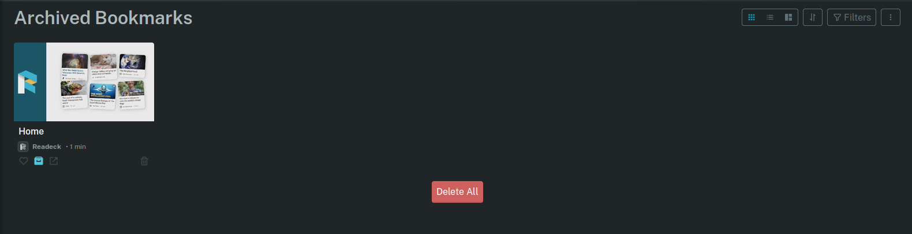
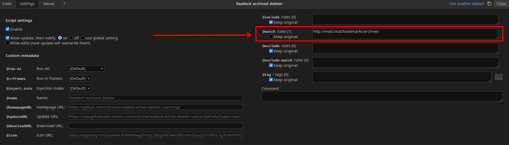

# readeck-achive-deleter-userscript
a userscript for a button that deletes all archived posts/items in Readeck

You do have to update the `YOUR_READECK_INSTANCE` placeholder in the `@match` setting to your Readeck instance.

If I still use Readeck and the UI changes, I will update this script. If you use Violentmonkey, you can hardcode your instance URL in the script settings like so:

[Raw userscript link for easy access](https://raw.githubusercontent.com/m3rone/readeck-achive-deleter-userscript/refs/heads/main/readeckdel.user.js)
